# Unidad 1 - Diseño de circuitos impresos

## Índice

- [Introducción.]()
- [Clases de rendimiento en circuitos impresos.]()
- [Proceso general de diseño.]()
- [Categorías de producibilidad.]()
- [Herramienta de diseño seleccionada.]()
- [1.1. Creación de un proyecto de circuito impreso.]()
- [1.1.1. Diseño de circuitos esquemáticos.]()
- [1.1.2. Diseño de circuitos impresos.]()
- [1.1.3. Ejercicios de diseño en clase.]()
- [1.2. Manufactura de circuitos impresos.]()
- [1.3. Definición del proyecto de aula.]()
- [1.3.1. Objetivos y actividades.]()
- [1.3.2. Requerimientos. ]()
- [1.3.3. Definición de la arquitectura.]()
- [1.3.4. Diseño del circuito impreso del proyecto de aula.]()
- [Referencias](#referencias)

## Introducción

En la actualidad, la mayoría de los circuitos electrónicos se fabrican utilizando placas de circuito impreso (PCB). En este curso, se pretende abordar la iteración completa del desarrollo de circuitos impresos, tomando como base una aplicación de sistemas embebidos y otros circuitos integrados (IC).

Las placas de circuito impreso (PCB) son uno de los elementos fundamentales en cualquier dispositivo electrónico contemporáneo. Su función principal radica en ofrecer una plataforma para la interconexión de los componentes electrónicos en un circuito, desempeñando también un papel crucial en la disipación de calor y en la protección contra interferencias electromagnéticas.

Es crucial que los ingenieros electrónicos, electricidad y campos relacionados adquieran destrezas necesarias para diseñar y desarrollar tecnologías que garanticen seguridad, eficiencia y satisfacción de las necesidades de los usuarios finales. Asimismo, el perfeccionamiento de habilidades en ingeniería habilita a los profesionales para mantener su competitividad en un mercado global cada vez más desafiante y dinámico.

Cuando se lleva a cabo el diseño y la construcción de PCB, resulta fundamental proporcionar diagramas de circuito precisos y exhaustivos, ilustraciones detalladas del diseño, dimensiones, restricciones, requisitos, una lista completa de materiales (BOM), documentos de coordenadas esenciales para el proceso de "pick and place", así como los "firmwares" necesarios para microcontroladores. En términos generales, el éxito del proceso de diseño y construcción de PCB depende de suministrar información detallada y adherirse a las mejores prácticas en la fabricación de productos electrónicos. Resumiremos este proceso en etapas que abarcan el diseño de circuito, el diseño de la PCB, la fabricación y las pruebas del producto.

Las normas que estandarizan el diseño, fabricación, montaje y mantenimiento de circuitos impresos están mantenidas por la Asociación IPC (*Institute of Printed Circuits*), la cual está acreditada por la *American National Standards Institute* (ANSI). En este curso, se prestará especial atención a la norma IPC-2221, la cual define y establece los requisitos mínimos del diseño de PCB para garantizar la fabricación y montaje adecuado.

### Clases de rendimiento en circuitos impresos

Según la norma IPC 221A, existen tres clases de productos finales según su nivel de sofisticación, requerimientos de de rendimiento funcional y frecuencia de inspección y pruebas. Estas clases son:

1. **Clase 1. Productos electrónicos generales**. Incluye productos de consumo, algunas computadoras y periféricos de computadora, así como hardware militar general. Se aceptan imperfecciones del tipo estético. 

2. **Clase 2. Productos electrónicos de servicio dedicado**. En esta categoría se incluyen dispositivos que tengan un alto rendimiento y una vida útil prolongada, ya que están pensados para proporcionar servicio ininterrumpido. En esta categoría se incluyen equipos de comunicaciones, máquinas comerciales sofisticadas, instrumentos y equipos militares. También se aceptan imperfecciones del tipo estético.

3. **Productos electrónicos de alta fiabilidad**. Los dispositivos de esta categoría están pensados el funcionamiento continuo o bajo demanda, es decir, para prestar servicio ininterrumpido y con un alto nivel de seguridad. Los equipos de esta categoría pueden prestar funciones como soporte vital o sistemas de control críticos en aplicaciones ferroviarias, automotrices, aeroespaciales o de la industria nuclear.

### Categorías de producibilidad

La norma IPC-2221 también define tres niveles de complejidad de diseño de circuitos impresos, según las características, tolerancias, mediciones, ensamblaje, pruebas de finalización o verificación del proceso de fabricación que reflejen aumentos progresivos en la sofisticación de las herramientas, materiales o procesamiento y, por lo tanto, aumentos progresivos en el costo de fabricación. Estos niveles son:

1. **Nivel A**. Complejidad general del diseño.

2. **Nivel B**. Complejidad de diseño moderada.

3. **Nivel C**. Alta complejidad de diseño.

Los niveles de producibilidad se entiende como un método para informar el grado de dificultad de una característica entre el diseño y las instalaciones de fabricación/ensamblaje.

## Proceso general de diseño

A continuación, se presenta el procedimiento general de diseño. Este es un procedimiento general con el cual es posible obtener un resultado mínimo viable de circuito impreso. Este procedimiento puede incluir más pasos dependiendo del grado de complejidad y la clase de producto que se desea crear. 

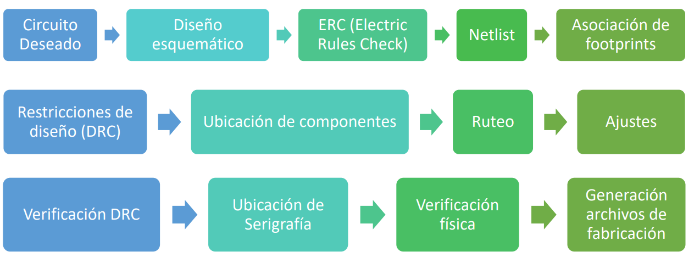

## Herramienta EDA

Las herramientas EDA (*Electronic Design Automation*) o herramienta de Automatización de Diseño Electrónico, son un conjunto de programas de software utilizados en el diseño y análisis de circuitos electrónicos. Estas herramientas abarcan desde la captura esquemática, simulación, síntesis, diseño de placas de circuito impreso (PCB), entre otras. Las herramientas EDA son muy importantes en la industria de la electrónica ya que permiten automatizar muchas de las tareas manuales que se realizaban en el diseño de circuitos y mejorar la precisión y eficiencia en el proceso de diseño.

En este curso se utilizará la herramienta [EasyEDA.](https://easyeda.com/es), la cual puede estar disponible de forma online o a través de la aplicación de escritorio. 

## 1.1. Creación de un proyecto de circuito impreso

Para crear un proyecto en EasyEDA se deben seguir los siguientes pasos:

1. Acceder a la página web de https://easyeda.com/ y crear una cuenta.

2. Se puede elegir entre trabajar online o descargar la aplicación de escritorio. 

	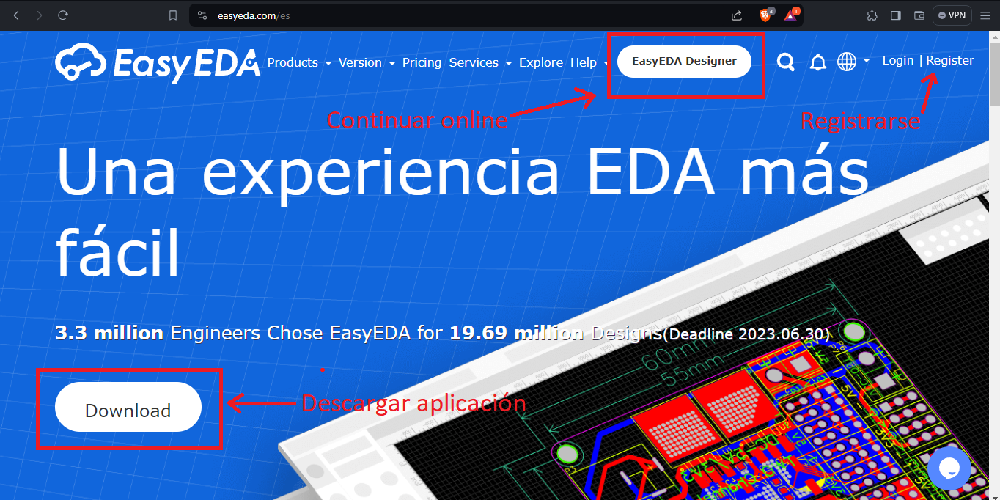
	
3. Ir a la pestaña ***"Archivo"*** seleccionar ***"Nuevo"*** y a continuación, seleccionar ***"Proyecto"***.
	
	

4. Se abrirá una nueva ventana donde debe indicar el nombre del proyecto y una descripción. Se recomienda dar un título suficientemente diciente y aportar una descripción técnica del circuito. Al finalizar, dar clic en ***"Guardar"***.

	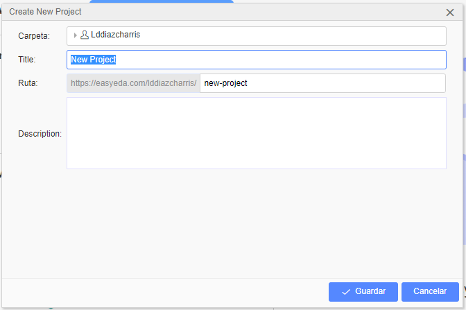

5. Al crear el proyecto, se abrirá la siguiente vista, la cual se distribuye como así:
	
	1. 1) Gestor de proyectos, librerías y servicios.
	2. 2) Ventana de trabajo. 
	3. 3) Barra de herramientas. 
	4. 4) Herramientas de cableado. 
	5. 5) Herramientas de dibujo. 
	6. 6) Panel de propiedades.
	7. 7) Hoja de esquemático. 
	
	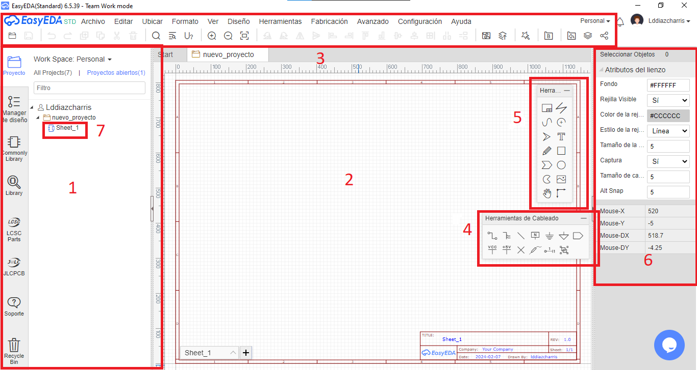

### *1.1.1. Diseño de circuitos esquemáticos*

El diagrama esquemático/lógico inicial designa las funciones eléctricas y la interconectividad que se proporcionarán al diseñador para la placa impresa y su ensamblaje. Este esquema debe definir, cuando corresponda, áreas críticas de disposición del circuito, requisitos de blindaje, requisitos de puesta a tierra y distribución de energía, la asignación de puntos de prueba y cualquier ubicación predefinida de conectores de entrada/salida. La información esquemática puede generarse en forma impresa o en forma de datos informáticos (manualmente o de forma automatizada).

#### *1.1.1.1. Requisitos iniciales para el esquemático*

Para realizar un buen circuito esquemático se deben tener en cuenta los siguientes puntos:

1. De lo primero que se debe partir es de un diseño esquemático fiable, estudiado y probado previamente. De esta manera, se asegura una gran parte de que el circuito impreso posterior será funcional. Lo siguiente es dibujar el circuito esquemático usando la herramienta EDA. 

2. Luego, se debe tener claro el tipo de tecnología de circuito impreso que se desea implementar:

	1. Tecnología THT (Through-Hole Technology)
	2. Tecnología SMT (Surface Mount Technology)
	
	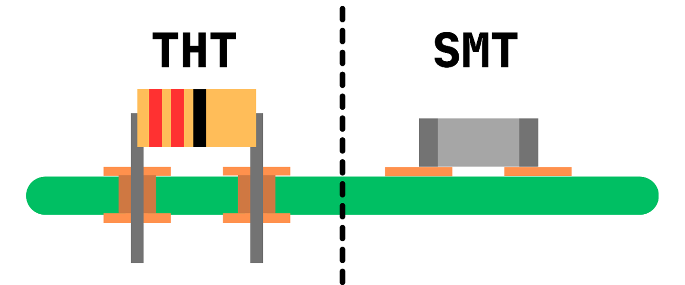
	
3. Preguntarse ¿Quién fabricará el circuito impreso? De esta pregunta partirá el enfoque de diseño que se tome. Si la respuesta es - *Yo mismo*, entonces se deben considerar las capacidades técnicas disponibles, herramientas y demás. Si la respuesta es - *El fabricante X*, también se deberá consultar sus capacidades técnicas y realizar las cotizaciones respectivas. 

4. Seleccionar los componentes de la biblioteca de la herramienta EDA. Este no es un trabajo trivial, ya que hay que considerar:

	1. Los componentes seleccionados deben ser compatibles entre sí y con el resto del circuito. Verificar que las especificaciones eléctricas y mecánicas de los componentes sean las adecuadas para el diseño.
	
	2. Verificar que los componentes se necesiten estén disponibles en el mercado y que se puedan adquirir fácilmente. En algunos casos, es posible que se deban elegir componentes alternativos cuando no haya disponibilidad de los principales.
	
	3. Asegurarse de que los componentes seleccionados estén dentro del presupuesto. Verificar los precios de diferentes proveedores y considerar alternativas de menor costo si es necesario.
	
	4. Seleccionar componentes de alta calidad para asegurar el rendimiento y la confiabilidad de la PCB. Verificar las especificaciones de los fabricantes y las calificaciones de los componentes antes de elegirlos.
	
	5. Verificar que los componentes se elijan sean de tamaño y forma adecuados para la PCB. Asegurarse de que los componentes puedan ajustarse adecuadamente en el área de la PCB disponible.

Luego de lo anterior, ahí sí se puede empezar a dibujar el circuito impreso. 

#### *1.1.1.2. Distribución del esquemático* 

1. **Definir el rótulo**. Normalmente el rótulo del circuito esquemático se encuentra en la parte inferior derecha de la hoja de trabajo para el esquemático. En EasyEDA, al dar doble clic sobre cada uno de los campos del rótulo, se podrá cambiar la información. Sea lo más explícito posible y complete toda la información requerida. 

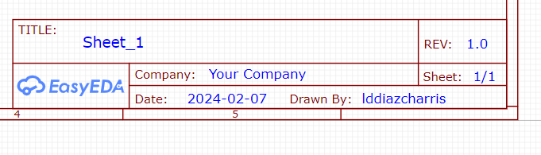

2. **Definir la jerarquía del esquemático**

	- Piense en si necesita más de una hoja de dibujo para plasmar su esquemático. En caso de ser así, haga uso de las etiquetas globales y locales. Las etiquetas globales le permiten pasar señales desde una hoja hacia otra. Mientras que las etiquetas locales únicamente interconectan en la misma hoja donde se definen. 
	- En caso que algunos subcircuitos sean muy simples y pequeños, se puede evaluar agruparlos en una hoja.
	- Pensar en no sobrecargar las hojas.
	- Analizar las líneas de interconexión entre circuitos.
	- Pensar en el trabajo en grupo, donde se distribuye el diseño por hojas para bajar los tiempos de diseño o por áreas de experiencia.
	- Si utiliza varias hojas, considere usar un índice. El índice se coloca generalmente en la primera página y permite ubicar rápidamente un subcircuito.

3. **Definir bloques funcionales**. La demarcación de subcircuitos tiene como objetivo lograr una interpretación bien clara del sistema.

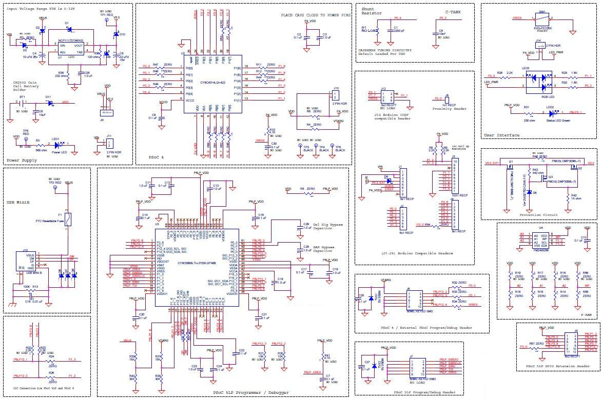

[*Fuente*](https://static5.arrow.com/pdfs/2014/4/28/1/39/50/371/cyp_/manual/cy8ckit-040_fig.1_4.jpg)

4. **Flujo de lectura**. No siempre es fácil cumplir esto.

- Se intentan tener un flujo de izquierda a derecha. 

	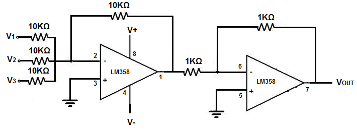
	
	[*Fuente*](http://www.learningaboutelectronics.com/images/Summing-amplifier-circuit.png)

	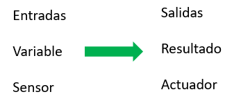

- Tensión superior arriba, tensión neutra en el centro y tensión inferior abajo.

	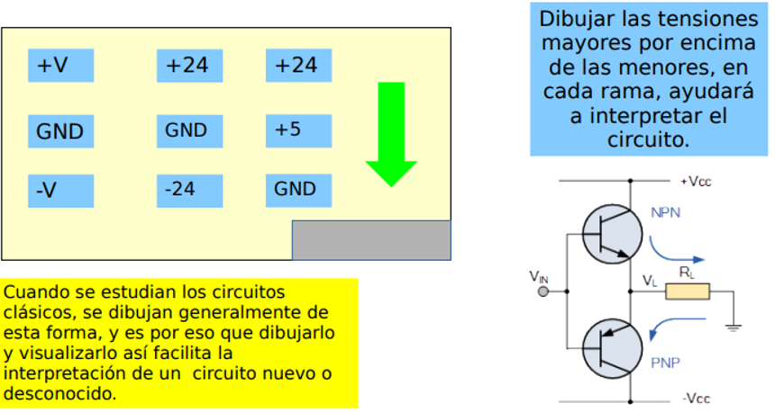
	
	[Autor: Mg. Ing. Diego Brengi. Imagen tomada del Curso del curso de Diseño de Circuitos Impresos de la Carrera de Especialización en Sistemas Embebidos. Facultad de Ingeniería Universidad de Buenos Aires.].
	
#### *1.1.1.3. Conexiones en el esquemático* 

Esta es quizá la labor más intuitiva de todo el proceso, y consiste en interconectar los componentes. Así mismo, es la labor más importante, ya que de esta depende la funcionalidad del circuito. Para esto hay que tener las siguientes consideraciones:

1. Principalmente se debe considerar que cada línea de conexión debe poder ser inspeccionada visualmente de manera clara y simple. Colocar y orientar los componentes de manera simétrica ayuda a esta tarea.

	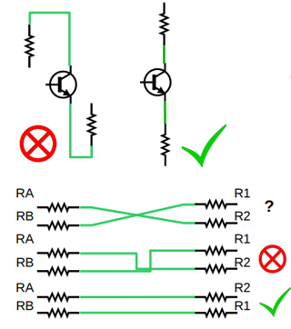
	[Autor: Mg. Ing. Diego Brengi. Imagen tomada del Curso del curso de Diseño de Circuitos Impresos de la Carrera de Especialización en Sistemas Embebidos. Facultad de Ingeniería Universidad de Buenos Aires.].

2. Cuando se necesite pasar líneas de conexión contiguas, se debe evitar entrecruzarlas. 

	
	[Autor: Mg. Ing. Diego Brengi. Imagen tomada del Curso del curso de Diseño de Circuitos Impresos de la Carrera de Especialización en Sistemas Embebidos. Facultad de Ingeniería Universidad de Buenos Aires.].

3.  Se recomienda realizar líneas de conexión a 90° (solo aplica para el esquemático). Se debe evitar realizar líneas de conexión en diagonales. 

	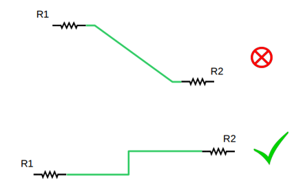
	[Autor: Mg. Ing. Diego Brengi. Imagen tomada del Curso del curso de Diseño de Circuitos Impresos de la Carrera de Especialización en Sistemas Embebidos. Facultad de Ingeniería Universidad de Buenos Aires.].

**Ejemplo:**

[Autor: Mg. Ing. Diego Brengi. Imagen tomada del Curso del curso de Diseño de Circuitos Impresos de la Carrera de Especialización en Sistemas Embebidos. Facultad de Ingeniería Universidad de Buenos Aires.].

	

### *1.1.2. Diseño de circuitos impresos*

### *1.1.3. Ejercicios de diseño en clase*

## 1.2. Manufactura de circuitos impresos

## 1.3. Definición del proyecto de aula

### *1.3.1. Objetivos y actividades*

### *1.3.2. Requerimientos*

### *1.3.3. Definición de la arquitectura*

### *1.3.4. Diseño del circuito impreso del proyecto de aula*

## Enlaces de interés

- [Ir al principio de este documento (Unidad 1)](#índice)
- [Índice general del curso](/readme.md)
- [guía de instalación de las herramientas del curso](1.9_guia_instal_tools.md)
- [Unidad 2](/Unidad_2/readme.md)
- [Unidad 3](/Unidad_3/readme.md)

# Referencias

- [1] René Beuchat, Florian Depraz, Andrea Guerrieri, Sahand Kashani. *Fundamentals of System-on-Chip Design on Arm Cortex-M Microcontrollers*. ARM Educational Media. 2021.
- [2] TOCCI, RONALD J., NEAL S. WIDMER, GREGORY L. MOSS. *Sistemas digitales. Principios y aplicaciones*. Décima edición. Pearson Educación, México, 2007. ISBN: 978-970-26-0970-4. 
- [3] Jorge R. Osio, Walter J. Aróztegui, José A. Rapallini. Sistemas digitales basados en microcontroladores. Facultad de Ingeniería Universidad Nacional de la Plata. EDULP. 
- [4] Enrique Palacios Municio, Fernando Remiro Domínguez y Lucas J. López Pérez. *Microcontrolador PIC16f84. Desarrollo de Proyectos*. 3ª Edición. Editorial RA-MA. ISBN 978-84-9964-917-2. 2014.
- [5] ARIEL LUTENBERG, PABLO GOMEZ, ERIC PERNIA. *A Beginner’s Guide to Designing Embedded System Applications on Arm® Cortex®-M Microcontrollers*. ARM Education Media. ISBN: 978-1-911531-42-5 (ePDF)
- [6] BRIAN W. KERNIGHAN y DENNIS M. RITCHIE. *El lenguaje de programación C*. 2da Edición. Pearson Education. 1991. Prentice-Hall Hispanoamericana. 
- [7] UGR. https://ccia.ugr.es/~jfv/ed1/c/cdrom/cap2/cap28.htm#ej_c
- [8] UGR. https://elvex.ugr.es/decsai/c/apuntes/control.pdf
- [9] UC3M. https://www.it.uc3m.es/pbasanta/asng/course_notes/input_output_printf_es.html
- [10] UC3. https://www.it.uc3m.es/pbasanta/asng/course_notes/input_output_function_scanf_es.html 
- [11] UC3M. https://www.it.uc3m.es/pbasanta/asng/course_notes/pointers_es.html
- [12] UC3M. https://www.it.uc3m.es/pbasanta/asng/course_notes/functions_es.html 
- [13] UC3M. https://www.it.uc3m.es/pbasanta/asng/course_notes/data_types_es.html
- [14] https://www.tutorialspoint.com/cprogramming/c_type_casting.htm
- [15] https://elvex.ugr.es/decsai/c/
- [16] https://disenowebakus.net/matrices.php
- [17] https://docs.espressif.com/projects/esp-idf/en/latest/esp32/hw-reference/esp32/get-started-devkitc.html 
