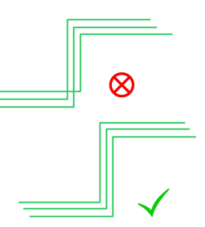
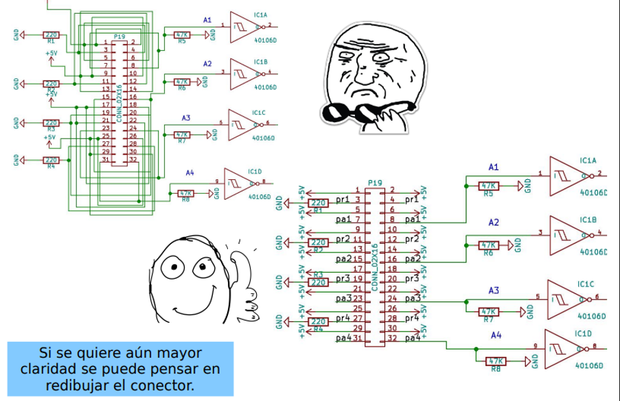

# Unidad 1 - Diseño de circuitos impresos

## Índice

- [Introducción.]()
- [Clases de rendimiento en circuitos impresos.]()
- [Proceso general de diseño.]()
- [Categorías de producibilidad.]()
- [Herramienta de diseño seleccionada.]()
- [1.1. Creación de un proyecto de circuito impreso.]()
- [1.1.1. Diseño de circuitos esquemáticos.]()
- [1.1.2. Diseño de circuitos impresos.]()
- [1.1.3. Ejercicios de diseño en clase.]()
- [1.2. Manufactura de circuitos impresos.]()
- [1.3. Definición del proyecto de aula.]()
- [1.3.1. Objetivos y actividades.]()
- [1.3.2. Requerimientos. ]()
- [1.3.3. Definición de la arquitectura.]()
- [1.3.4. Diseño del circuito impreso del proyecto de aula.]()
- [Referencias](#referencias)

## Introducción

En la actualidad, la mayoría de los circuitos electrónicos se fabrican sobre placas de circuito impreso (PCB). En este curso, se pretende abordar la iteración completa del desarrollo de circuitos impresos, tomando como base una aplicación de sistemas embebidos.

Las placas de circuito impreso (PCB) son uno de los elementos fundamentales en cualquier dispositivo electrónico contemporáneo. Su función principal radica en ofrecer una plataforma para la interconexión de los componentes electrónicos en un circuito, que permita aportar robustez mecánica, disipación de calor y protección contra interferencias electromagnéticas.

Es importante que los ingenieros electrónicos y campos relacionados adquieran destrezas necesarias para diseñar y desarrollar tecnologías que garanticen seguridad, eficiencia y satisfacción de las necesidades de los usuarios finales. Asimismo, el perfeccionamiento de habilidades en ingeniería habilita a los profesionales para mantener su competitividad en un mercado global cada vez más desafiante y dinámico.

Cuando se lleva a cabo el diseño y la construcción de una PCB, se hace necesario desarrollar diagramas de circuito precisos y exhaustivos, ilustraciones detalladas del diseño, dimensiones, restricciones, requisitos, una lista completa de materiales (BOM), documentos de coordenadas esenciales para el proceso de "pick and place", así como el *firmware* necesario para los microcontroladores o microprocesadores. En términos generales, el éxito del proceso de diseño y construcción de PCB depende de suministrar información detallada y adherirse a las mejores prácticas en la fabricación de productos electrónicos. Resumiremos este proceso en etapas que abarcan el diseño de circuito, el diseño de la PCB, la fabricación y las pruebas del producto.

Las normas que estandarizan el diseño, fabricación, montaje y mantenimiento de circuitos impresos están mantenidas por la Asociación IPC (*Institute of Printed Circuits*), la cual está acreditada por la *American National Standards Institute* (ANSI). En este curso, se prestará especial atención a la norma IPC-2221, la cual define y establece los requisitos mínimos del diseño de PCB para garantizar la fabricación y montaje adecuado.

### Clases de rendimiento en circuitos impresos

Según la norma IPC 221A, existen tres clases de productos finales según su nivel de sofisticación, requerimientos de de rendimiento funcional y frecuencia de inspección y pruebas. Estas clases son:

1. **Clase 1. Productos electrónicos generales**. Incluye productos de consumo, algunas computadoras y periféricos de computadora, así como hardware militar general. Se aceptan imperfecciones del tipo estético. 

2. **Clase 2. Productos electrónicos de servicio dedicado**. En esta categoría se incluyen dispositivos que tengan un alto rendimiento y una vida útil prolongada, ya que están pensados para proporcionar servicio ininterrumpido. En esta categoría se incluyen equipos de comunicaciones, máquinas comerciales sofisticadas, instrumentos y equipos militares. También se aceptan imperfecciones del tipo estético.

3. **Productos electrónicos de alta fiabilidad**. Los dispositivos de esta categoría están pensados el funcionamiento continuo o bajo demanda, es decir, para prestar servicio ininterrumpido y con un alto nivel de seguridad. Los equipos de esta categoría pueden prestar funciones como soporte vital o sistemas de control críticos en aplicaciones ferroviarias, automotrices, aeroespaciales o de la industria nuclear.

### Categorías de producibilidad

La norma IPC-2221 también define tres niveles de complejidad de diseño de circuitos impresos, según las características, tolerancias, mediciones, ensamblaje, pruebas de finalización o verificación del proceso de fabricación que reflejen aumentos progresivos en la sofisticación de las herramientas, materiales o procesamiento y, por lo tanto, aumentos progresivos en el costo de fabricación. Estos niveles son:

1. **Nivel A**. Complejidad general del diseño.

2. **Nivel B**. Complejidad de diseño moderada.

3. **Nivel C**. Alta complejidad de diseño.

Los niveles de producibilidad se entiende como un método para informar el grado de dificultad de una característica entre el diseño y las instalaciones de fabricación/ensamblaje.

## Proceso general de diseño

A continuación, se presenta el procedimiento general de diseño. Este es un procedimiento general con el cual es posible obtener un resultado mínimo viable de circuito impreso. Este procedimiento puede incluir más pasos dependiendo del grado de complejidad y la clase de producto que se desea crear. 

## Herramienta EDA

Las herramientas EDA (*Electronic Design Automation*) o herramienta de Automatización de Diseño Electrónico, son un conjunto de programas de software utilizados en el diseño y análisis de circuitos electrónicos. Estas herramientas abarcan desde la captura esquemática, simulación, síntesis, diseño de placas de circuito impreso (PCB), entre otras. Las herramientas EDA son muy importantes en la industria de la electrónica ya que permiten automatizar muchas de las tareas manuales que se realizaban en el diseño de circuitos y mejorar la precisión y eficiencia en el proceso de diseño.

En este curso se utilizará la herramienta [EasyEDA.](https://easyeda.com/es), la cual puede estar disponible de forma online o a través de la aplicación de escritorio. 

## 1.1. Creación de un proyecto de circuito impreso

Para crear un proyecto en EasyEDA se deben seguir los siguientes pasos:

1. Acceder a la página web de https://easyeda.com/ y crear una cuenta.

2. Se puede elegir entre trabajar online o descargar la aplicación de escritorio. 

	
	
3. Ir a la pestaña ***"Archivo"*** seleccionar ***"Nuevo"*** y a continuación, seleccionar ***"Proyecto"***.
	
	

4. Se abrirá una nueva ventana donde debe indicar el nombre del proyecto y una descripción. Se recomienda dar un título suficientemente diciente y aportar una descripción técnica del circuito. Al finalizar, dar clic en ***"Guardar"***.

	

5. Al crear el proyecto, se abrirá la siguiente vista, la cual se distribuye como así:
	
	1. 1) Gestor de proyectos, librerías y servicios.
	2. 2) Ventana de trabajo. 
	3. 3) Barra de herramientas. 
	4. 4) Herramientas de cableado. 
	5. 5) Herramientas de dibujo. 
	6. 6) Panel de propiedades.
	7. 7) Hoja de esquemático. 
	
	

### *1.1.1. Diseño de circuitos esquemáticos*

El diagrama esquemático/lógico inicial designa las funciones eléctricas y la interconectividad que se proporcionarán al diseñador para la placa impresa y su ensamblaje. Este esquema debe definir, cuando corresponda, áreas críticas de disposición del circuito, requisitos de blindaje, requisitos de puesta a tierra y distribución de energía, la asignación de puntos de prueba y cualquier ubicación predefinida de conectores de entrada/salida. La información esquemática puede generarse en forma impresa o en forma de datos informáticos (manualmente o de forma automatizada).

#### *1.1.1.1. Requisitos iniciales para el esquemático*

Para realizar un buen circuito esquemático se deben tener en cuenta los siguientes puntos:

1. De lo primero que se debe partir es de un diseño esquemático fiable, estudiado y probado previamente. De esta manera, se asegura una gran parte de que el circuito impreso posterior será funcional. Lo siguiente es dibujar el circuito esquemático usando la herramienta EDA. 

2. Luego, se debe tener claro el tipo de tecnología de circuito impreso que se desea implementar:

	1. Tecnología THT (Through-Hole Technology)
	2. Tecnología SMT (Surface Mount Technology)
	
	
	
3. Preguntarse ¿Quién fabricará el circuito impreso? De esta pregunta partirá el enfoque de diseño que se tome. Si la respuesta es - *Yo mismo*, entonces se deben considerar las capacidades técnicas disponibles, herramientas y demás. Si la respuesta es - *El fabricante X*, también se deberá consultar sus capacidades técnicas y realizar las cotizaciones respectivas. 

4. Seleccionar los componentes de la biblioteca de la herramienta EDA. Este no es un trabajo trivial, ya que hay que considerar:

	1. Los componentes seleccionados deben ser compatibles entre sí y con el resto del circuito. Verificar que las especificaciones eléctricas y mecánicas de los componentes sean las adecuadas para el diseño.
	
	2. Verificar que los componentes se necesiten estén disponibles en el mercado y que se puedan adquirir fácilmente. En algunos casos, es posible que se deban elegir componentes alternativos cuando no haya disponibilidad de los principales.
	
	3. Asegurarse de que los componentes seleccionados estén dentro del presupuesto. Verificar los precios de diferentes proveedores y considerar alternativas de menor costo si es necesario.
	
	4. Seleccionar componentes de alta calidad para asegurar el rendimiento y la confiabilidad de la PCB. Verificar las especificaciones de los fabricantes y las calificaciones de los componentes antes de elegirlos.
	
	5. Verificar que los componentes se elijan sean de tamaño y forma adecuados para la PCB. Asegurarse de que los componentes puedan ajustarse adecuadamente en el área de la PCB disponible.

Luego de lo anterior, ahí sí se puede empezar a dibujar el circuito impreso. 

#### *1.1.1.2. Distribución del esquemático* 

1. **Definir el rótulo**. Normalmente el rótulo del circuito esquemático se encuentra en la parte inferior derecha de la hoja de trabajo para el esquemático. En EasyEDA, al dar doble clic sobre cada uno de los campos del rótulo, se podrá cambiar la información. Sea lo más explícito posible y complete toda la información requerida. 

2. **Definir la jerarquía del esquemático**

	- Piense en si necesita más de una hoja de dibujo para plasmar su esquemático. En caso de ser así, haga uso de las etiquetas globales y locales. Las etiquetas globales le permiten pasar señales desde una hoja hacia otra. Mientras que las etiquetas locales únicamente interconectan en la misma hoja donde se definen. 
	- En caso que algunos subcircuitos sean muy simples y pequeños, se puede evaluar agruparlos en una hoja.
	- Pensar en no sobrecargar las hojas.
	- Analizar las líneas de interconexión entre circuitos.
	- Pensar en el trabajo en grupo, donde se distribuye el diseño por hojas para bajar los tiempos de diseño o por áreas de experiencia.
	- Si utiliza varias hojas, considere usar un índice. El índice se coloca generalmente en la primera página y permite ubicar rápidamente un subcircuito.

3. **Definir bloques funcionales**. La demarcación de subcircuitos tiene como objetivo lograr una interpretación bien clara del sistema.

[*Fuente*](https://static5.arrow.com/pdfs/2014/4/28/1/39/50/371/cyp_/manual/cy8ckit-040_fig.1_4.jpg)

4. **Flujo de lectura**. No siempre es fácil cumplir esto.

- Se intentan tener un flujo de izquierda a derecha. 

	
	
	[*Fuente*](http://www.learningaboutelectronics.com/images/Summing-amplifier-circuit.png)

	

- Tensión superior arriba, tensión neutra en el centro y tensión inferior abajo.

	
	
	[Autor: Mg. Ing. Diego Brengi. Imagen tomada del Curso del curso de Diseño de Circuitos Impresos de la Carrera de Especialización en Sistemas Embebidos. Facultad de Ingeniería Universidad de Buenos Aires.].
	
#### *1.1.1.3. Conexiones en el esquemático* 

Esta es quizá la labor más intuitiva de todo el proceso, y consiste en interconectar los componentes. Así mismo, es la labor más importante, ya que de esta depende la funcionalidad del circuito. Para esto hay que tener las siguientes consideraciones:

1. Principalmente se debe considerar que cada línea de conexión debe poder ser inspeccionada visualmente de manera clara y simple. Colocar y orientar los componentes de manera simétrica ayuda a esta tarea.

	
	[Autor: Mg. Ing. Diego Brengi. Imagen tomada del Curso del curso de Diseño de Circuitos Impresos de la Carrera de Especialización en Sistemas Embebidos. Facultad de Ingeniería Universidad de Buenos Aires.].

2. Cuando se necesite pasar líneas de conexión contiguas, se debe evitar entrecruzarlas. 

	
	[Autor: Mg. Ing. Diego Brengi. Imagen tomada del Curso del curso de Diseño de Circuitos Impresos de la Carrera de Especialización en Sistemas Embebidos. Facultad de Ingeniería Universidad de Buenos Aires.].

3.  Se recomienda realizar líneas de conexión a 90° (solo aplica para el esquemático). Se debe evitar realizar líneas de conexión en diagonales. 

	
	[Autor: Mg. Ing. Diego Brengi. Imagen tomada del Curso del curso de Diseño de Circuitos Impresos de la Carrera de Especialización en Sistemas Embebidos. Facultad de Ingeniería Universidad de Buenos Aires.].

**Ejemplo:**

[Autor: Mg. Ing. Diego Brengi. Imagen tomada del Curso del curso de Diseño de Circuitos Impresos de la Carrera de Especialización en Sistemas Embebidos. Facultad de Ingeniería Universidad de Buenos Aires.].

#### *1.1.1.4. Asociación de Footprints*

Un *"footprint"* o huella es básicamente la disposición física y las dimensiones de los pads (patrones) de soldadura y los agujeros de montaje para un componente específico en una PCB. Estas asociaciones de footprints son críticas para asegurar que los componentes se ajusten correctamente y se puedan soldar correctamente en la PCB durante el proceso de fabricación.

Para asegurar que el diseño físico de la PCB sea el adecuado, es necesario que en la sección del esquemático se seleccionen y asignen los patrones de montaje superficial SMD o y/o los orificios pasantes (TH) adecuados para los componentes electrónicos en la PCB.

Los footprints deben coincidir exactamente con las especificaciones de los componentes que se van a montar en la PCB. Esto implica tener en cuenta el tamaño, la forma y la disposición de los pads de soldadura, así como la ubicación y el tamaño de los agujeros de montaje si se trata de componentes de montaje en superficie o de agujeros pasantes.

Debido a lo anterior, se requiere del conocimiento de las hojas de datos (datasheets) de cada componente, en los cuales se encuentra información de las características mecánicas de los componentes electrónicos. 

EasyEda Facilita la tarea de la asignación de footprints, a continuación, se presenta una metodología para realizar esta tarea:

1. **Crear o abrir un proyecto:** Inicia sesión en tu cuenta de EasyEDA y crea un nuevo proyecto o abre uno existente en el que estés trabajando en el diseño de tu PCB.

2. **Agregar componentes:** Utiliza la biblioteca de componentes de EasyEDA para buscar y agregar los componentes que deseas utilizar en tu diseño de PCB. Puedes encontrar los componentes buscando por su nombre o su número de parte.

3. **Asignar footprints:** Una vez que hayas agregado un componente a tu diseño, haz clic derecho sobre él y selecciona "Propiedades...". Esto abrirá una ventana donde puedes editar las propiedades del componente, incluyendo su footprint. Deberás hacer *"scroll"* hasta la sección **"Atributos personalizados"** en la opción **"Huella"**.

	
	

4. **Seleccionar un footprint:** Con solo hacer clic izquierdo sobre el campo de **"Huella"**, se abrirá la ventana de edición del componente. En la parte superior derecha busca la sección de "Search Footprint" (depende de la versión de EasyEDA que estés utilizando). Aquí puedes buscar y  seleccionar el footprint adecuado para el componente que has agregado. Puedes buscar footprints específicos o navegar a través de las categorías disponibles.

	

5. **Guardar los cambios:** Una vez que hayas seleccionado el footprint adecuado para el componente, guarda los cambios haciendo clic en "Actualizar Huella" en la ventana de edición del componente.

6. **Repetir el proceso:** Repite este proceso para cada uno de los componentes que has agregado a tu diseño de PCB, asegurándote de asignar el footprint correcto a cada uno.

### *1.1.2. Diseño de circuitos impresos*

#### Diseño de la PCB

### *1.1.3. Ejercicios de diseño en clase*

## 1.2. Manufactura de circuitos impresos

## 1.3. Definición del proyecto de aula

Para definir el el Proyecto de Aula se tendrán en cuenta los siguientes criterios: 

1. **Cantidad de integrantes por grupo:** El grupo de trabajo del semestre.

2. **Temática:** Libre. La única condición es que deben aplicarse soluciones con microcontroladores.

3.	**Modalidades:**
	1. **Trabajo original.** El grupo de estudiantes plantea una problemática que identificó y propone una solución inédita y original. 
	
	2.	**Réplica y mejora.** El grupo de estudiantes busca la solución a una problemática que se plantea, replica dicha solución y le añade mejoras. Para esta modalidad, el estudiante debe presentar en su sustentación y trabajo escrito lo siguiente:
	
	- Fuente y circuito de donde tomó la réplica.
	- Código fuente de la referencia donde tomó la réplica. 
	- Explica lo que realiza el proyecto de referencia.
	- Explica las mejoras implementadas y las modificaciones al prototipo original (hardware y software).

4.	**Prototipo:**
	Debe presentar una demostración funcional del proyecto, la cual debe incluir:
	1. PCB implementada y funcional. El diseño debe ser propio. Esto aplica para las dos modalidades antes mencionadas. 
	1. Componentes mecánicos, hardware y software (web o escritorio) según exija el proyecto elegido. 
	1. Debe ser completamente funcional y estético.
		
5. **Propuesta de proyecto:**
	
	Al finalizar el primer corte de notas del semestre. Se debe preparar una sustentación oral sobre el proyecto elegido. En esta sustentación, se deben tratar los siguientes puntos:
		
	1. Problema planteado.
	2. Requerimientos.
	3. Objetivos (General y específicos).
	4. Actividades.

5. **Trabajo escrito:**
	
	Este es un documento que debe presentarse al finalizar el curso, a más tardar el último día de clases. Este documento debe contener lo siguiente y seguir la [Plantilla de Proyecto de Aula](Unidad_1/archivos/6_Plantilla_Proyecto_de_Aula.docx)
	
	1.	Descripción del problema abordado.
	1.	Descripción de los requerimientos del prototipo.
	1.	Descripción de la solución planteada: objetivos (general y específicos), breve descripción del prototipo y la arquitectura de la solución. 
	1.	Metodología: 
	1.	Descripción e imágenes de los resultados más importantes del proyecto.  Resultados de cada actividad realizada. Eje. Mostrar algoritmos (seudocódigo o diagrama de flujos) mostrar componentes del sistema (diagrama de clases), cada uno con su explicación.
	1.	Conclusiones.

6. **Sustentación final:**
	
	La sustentación final debe realizarse al terminar el curso. A más tardar el último día de clases. Esta debe considerar los siguientes puntos:
	
	- El problema abordado.
	- La solución planteada.
	- Metodología implementada.
	- Los resultados más relevantes.
	- Lecciones aprendidas.
		
7. **Ponderación**
	
	- Trabajo escrito (20% de la nota total)
	- Presentación oral y diapositivas. (30% de la nota total)
	- Prototipo. (50% de la nota total)
	- Si el grupo no presenta en la fecha prevista debe cargar también un vídeo con la sustentación. Esto afectará la nota final.
	- Si no tiene circuito implementado en físico se recibirá una simulación, pero el proyecto será calificado con nota máxima de 3.8.

8. **Evaluación**

	- Se tendrán en cuenta las rúbricas de evaluación adjuntas para la calificación de la sustentación oral y el trabajo escrito. A saber:
	1. Rubrica para calificar Sustentación oral de proyectos y/o presentaciones de temas.
	2. Rúbrica para evaluar Trabajos Escritos.
		-	El prototipo se calificará de acuerdo con el nivel de exigencia impuesto por el mejor prototipo (estética, implementación, materiales, etc.). 

### *1.3.1. Requerimientos*

Antes de iniciar el diseño de sistemas embebidos, se deben definir los requerimientos. Estos se refieren a las especificaciones y criterios que deben cumplir tanto el hardware como el software del sistema, para satisfacer las necesidades del proyecto o producto. Estos requerimientos son fundamentales para guiar el proceso de diseño y desarrollo de sistemas embebidos y asegurar que el sistema resultante cumpla con los objetivos deseados.

Los requerimientos pueden incluir una variedad de aspectos, como funcionalidad, rendimiento, confiabilidad, seguridad, consumo de energía, tamaño y costo. Algunos ejemplos de requerimientos comunes en el diseño de sistemas embebidos incluyen:

**Funcionalidad:** Qué funciones debe realizar el sistema, como adquirir datos de sensores, procesar información, controlar actuadores, comunicarse con otros dispositivos, etc.

**Rendimiento:** La velocidad de procesamiento necesaria. La cantidad máxima de datos que se deben procesar o almacenar en un cierto intervalo de tiempo.

**Confiabilidad:** La tolerancia a fallos del sistema. Los tiempos de respuesta ante eventos críticos.

**Seguridad:** Protección contra acceso no autorizado. Prevención de ataques y explotaciones de vulnerabilidades.

**Consumo de energía:** Los requisitos de energía del sistema y las restricciones de duración de la batería en sistemas alimentados por batería.

**Tamaño y costo:** El tamaño físico del sistema. Las limitaciones de costos asociadas con la producción del sistema.

Existen dos categorías principales de requerimientos que guían el diseño y desarrollo de sistemas de software y sistemas embebidos:

**Requerimientos Funcionales:**

Los requerimientos funcionales describen las funciones específicas que el sistema debe realizar y cómo debe comportarse en respuesta a ciertos entradas. Estos requerimientos se centran en lo que el sistema debe hacer para cumplir con los objetivos del usuario o del negocio.

Ejemplos:

- "El sistema debe ser capaz de medir la temperatura ambiente."
- "El sistema debe enviar una señal de alarma si la temperatura supera cierto umbral."
- "El sistema debe mostrar los datos de temperatura en un display LCD."

**Requerimientos No Funcionales:**

Los requerimientos no funcionales son atributos del sistema que no están directamente relacionados con las funciones específicas que realiza el sistema, sino más bien con cómo realiza esas funciones. Estos requerimientos se centran en aspectos de calidad, rendimiento, seguridad, usabilidad y otros atributos del sistema.

Ejemplos:

- Rendimiento: "El sistema debe ser capaz de procesar al menos 1000 lecturas de sensores por segundo."
- Seguridad: "El acceso al sistema debe estar protegido por autenticación de dos factores."
- Usabilidad: "La interfaz de usuario debe ser intuitiva y fácil de usar, con tiempos de respuesta inferiores a 1 segundo."

### *1.3.2. Objetivos y actividades*

Los objetivos generales y actividades son componentes clave en la planificación y definición de metas en cualquier proyecto, incluidos los proyectos relacionados con sistemas embebidos.

**Objetivo General**

El objetivo general es la meta amplia y de alto nivel que se establecen para guiar el desarrollo general del proyecto. Este objetivo está relacionado con el propósito general del proyecto y las expectativas de resultado. El objetivo general proporciona una visión general y global del proyecto.

Ejemplo: 

*"Desarrollar un sistema embebido para controlar y monitorear el sistema de control de flujo de aire de un sistema de ventilación."*

**Objetivos Específicos:**

Los objetivos específicos son metas detalladas y concretas que se derivan del objetivo general y describen los logros específicos que deben alcanzarse para cumplir con el objetivo general del proyecto. Estos objetivos son más detallados en comparación con el objetivo general.

Ejemplos:

- "Diseñar el sistema embebido para el control de flujo de ventilación basado en microcontroladores."
- "Implementar el sistema embebido de control de flujo de ventilación en sitio."
- "Probar y validar el sistema embebido de control de flujo de ventilación implementado."

**Actividades o tareas**

En un proyecto, las actividades son las acciones específicas que se llevan a cabo para alcanzar los objetivos y metas del proyecto. Estas acciones están diseñadas para avanzar hacia la finalización del proyecto y pueden ser tareas individuales o conjuntos de tareas relacionadas que contribuyen al logro de un resultado específico.

Las actividades en un proyecto están comúnmente relacionadas a los objetivos específicos. Es decir, se agrupan según cada objetivo específico. Las actividades deben ser específicas, mensurables, estar acotadas en el tiempo (inicio y un fin claramente definidos), deben definir los recursos, tiempo y esfuerzo requeridos para completarse. Además, las actividades se planifican y organizan en secuencia lógica para garantizar una ejecución eficiente y efectiva del proyecto.

1. Descripción detallada: Cada actividad debe describirse en detalle, incluyendo qué se debe hacer, quién es responsable de hacerlo, cuándo debe completarse y qué recursos se necesitan.

1. Secuencia lógica: Las actividades se organizan en una secuencia lógica que refleja la dependencia entre ellas. Algunas actividades pueden depender del resultado de otras actividades y deben completarse en un orden específico.

1. Duración estimada: Se estima la duración de cada actividad, es decir, cuánto tiempo se necesita para completarla. Esta estimación ayuda a planificar el cronograma del proyecto y asignar recursos de manera efectiva.

1. Asignación de recursos: Cada actividad puede requerir recursos como personas, equipo, materiales o financiamiento. Es importante asignar los recursos adecuados a cada actividad para garantizar su ejecución exitosa.

1. Control y seguimiento: Se establecen criterios de control y seguimiento para cada actividad, lo que permite monitorear su progreso, identificar posibles desviaciones del plan y tomar medidas correctivas si es necesario.

**Ejemplo:** 

**Diseñar el sistema embebido para el control de flujo de ventilación basado en microcontroladores:**

- Investigación de requisitos de diseño: Estudiar y comprender los requisitos específicos del sistema de control de flujo de ventilación, incluyendo la capacidad de ventilación necesaria, los sensores y actuadores requeridos, y los límites de funcionamiento del sistema.
	
- Selección de componentes: Identificar y seleccionar los microcontroladores, sensores, actuadores y otros componentes necesarios para el diseño del sistema embebido.
	
- Diseño de hardware: Diseñar el esquemático del circuito y el diseño de PCB (Printed Circuit Board) que integre todos los componentes necesarios para el control de flujo de ventilación.
	
- Desarrollo de firmware: Escribir el código de firmware para el microcontrolador que controlará el funcionamiento del sistema de ventilación, incluyendo la lógica de control, la interfaz de usuario y la gestión de comunicaciones.
	
- Simulación y pruebas preliminares: Realizar simulaciones y pruebas preliminares para verificar el diseño del sistema embebido y garantizar su viabilidad antes de la implementación.

**Implementar el sistema embebido de control de flujo de ventilación en sitio:**

- Construcción de prototipo: Construir un prototipo del sistema embebido de control de flujo de ventilación utilizando los componentes y el firmware desarrollados en la fase de diseño.

- Instalación en sitio: Instalar el prototipo del sistema embebido en el sitio donde se va a utilizar el sistema de control de flujo de ventilación, asegurándose de seguir todas las normativas y regulaciones pertinentes.

- Integración con el sistema existente: Integrar el sistema embebido de control de flujo de ventilación con el sistema de ventilación existente, si lo hubiera, asegurando una comunicación efectiva y una operación coordinada entre los sistemas.

**Probar y validar el sistema embebido de control de flujo de ventilación implementado:**

- Pruebas de funcionamiento: Realizar pruebas exhaustivas para verificar que el sistema embebido de control de flujo de ventilación funcione según lo esperado en condiciones normales de operación.

- Pruebas de estrés: Realizar pruebas de estrés para evaluar la capacidad del sistema embebido de control de flujo de ventilación para manejar cargas de trabajo pesadas y situaciones adversas.

- Validación en campo: Validar el rendimiento del sistema embebido de control de flujo de ventilación en el entorno de uso real, asegurando que cumpla con los requisitos de rendimiento y funcionalidad establecidos.

- Optimización y ajuste: Realizar ajustes y optimizaciones en el sistema embebido según sea necesario en función de los resultados de las pruebas y la retroalimentación del usuario final.

### *1.3.3. Definición de la arquitectura*

La arquitectura de un sistema embebido se refiere a la estructura general y al diseño de alto nivel del sistema, incluyendo sus componentes, módulos, interfaces y relaciones entre ellos. Define cómo los diferentes elementos del sistema interactúan entre sí para cumplir con los requisitos del proyecto y lograr los objetivos establecidos.

Definir la arquitectura de un sistema embebido antes de su construcción es fundamental por varias razones:

Claridad y comprensión: La arquitectura proporciona una visión general clara de cómo se estructura y funciona el sistema embebido. Esto ayuda a los desarrolladores, diseñadores y partes interesadas a comprender la naturaleza del sistema y los roles de sus componentes.

División del trabajo: La arquitectura divide el sistema en componentes más pequeños y manejables, lo que facilita la asignación de tareas y responsabilidades a los equipos de desarrollo. Esto permite una mejor gestión del proyecto y una distribución eficiente de los recursos humanos y materiales.

Identificación de requisitos: Definir la arquitectura ayuda a identificar los requisitos funcionales y no funcionales del sistema. Esto permite establecer criterios claros para el diseño y la implementación de cada componente del sistema, así como para la validación y verificación del sistema completo.

Flexibilidad y escalabilidad: Una arquitectura bien definida proporciona una base sólida para la expansión y la evolución futura del sistema embebido. Permite agregar nuevas funcionalidades, modificar componentes existentes o adaptar el sistema para satisfacer nuevos requisitos sin necesidad de rediseñar todo el sistema desde cero.

Rendimiento y optimización: La arquitectura puede influir en el rendimiento y la eficiencia del sistema. Una arquitectura bien diseñada puede minimizar la sobrecarga y el consumo de recursos, optimizar el uso de la memoria y mejorar la velocidad de procesamiento del sistema.

### *1.3.4. Diseño del circuito impreso del proyecto de aula*

## Enlaces de interés

- [Ir al principio de este documento (Unidad 1)](#índice)
- [Índice general del curso](/readme.md)
- [guía de instalación de las herramientas del curso](1.9_guia_instal_tools.md)
- [Unidad 2](/Unidad_2/readme.md)
- [Unidad 3](/Unidad_3/readme.md)

# Referencias

- [1] 
