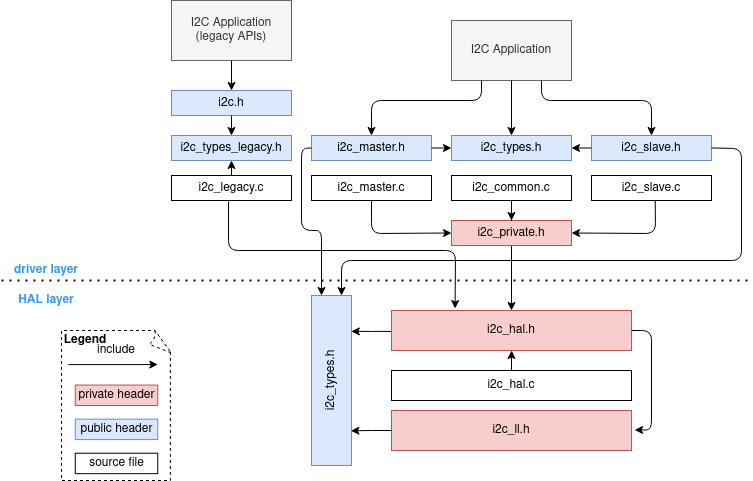

# Unidad 2 - Bibliotecas y Protocolos de comunicación

## Índice

- [2.1. Creación de bibliotecas o drivers para sensores.](#21-creación-de-bibliotecas-o-drivers-para-sensores)
- [2.2. Práctica de creación de bibliotecas o drivers.](#22-práctica-de-creación-de-bibliotecas-o-drivers)
- [2.3. Protocolos de comunicación digital ($I^2C$ y SPI).](#23-protocolos-de-comunicación-digital-i2c-y-spi)
	- [2.3.1. Protocolo $I^2C$](#231-protocolo-i2c)
	- 
- [2.4. Protocolos de comunicación inalámbrica (Bluetooth y WiFi).](#24-protocolos-de-comunicación-inalámbrica-bluetooth-y-wifi)
- [2.5. Programación de firmware del proyecto de aula.](#25-prototipo-funcional-del-proyecto-de-aula)
- [2.6. Programación de firmware del proyecto de aula.](#26-programación-de-firmware-del-proyecto-de-aula)

## 2.1. Creación de bibliotecas o drivers para sensores

En el mundo de los sistemas embebidos, es indispensable la inicialización y gestión de los dispositivos de hardware como sensores o actuadores. Para lograr esto, se recurre al software especializado conocido como <<controladores de dispositivo>> o *device drivers*. Estos programas son la columna vertebral que permite la interacción directa entre la capa de aplicación en el controlador principal (SoC, microcontrolador, etc.) y los dispositivos de hardware externos (sensores, actuadores, memorias, etc.).

Por lo anterior, en prácticamente todos los sistemas embebidos se requiere de la implementación de *device drivers* para garantizar el funcionamiento correcto y eficaz de una aplicación concreta.

Un *device driver* es un programa de software (firmware) que permite que una aplicación principal interactúe con un dispositivo de hardware específico. Un *device driver* proporciona una interfaz de software entre la aplicación principal y el hardware del dispositivo; es decir, proporciona las funciones necesarias para interactuar de manera correcta. 

Típicamente un *device driver* se encarga de las tareas de: inicialización, acceso a funciones, acceso a memoria, manejo de las interrupciones, gestión del flujo de datos y proporcionar una interfaz coherente y uniforme para el acceso al dispositivo.

A continuación, se presenta un diagrama de componentes y de capas:

**Tener en cuenta:* 

- Siempre se debe chequear los detalles del hardware para utilizar un driver de otro hardware similar.
- Nunca se debe asumir que un driver existente en el sistema embebido será compatible con un hardware particular.
- Solo se puede asumir que funcionará si es el mismo componente (100% idéntico).

### Clasificación de los device drivers

Los *device drivers* se pueden dividir en dos grupos:

1. **Específicos para la arquitectura**. Estos gestionan el hardware que está integrado en el procesador principal. Ejemplos: inicialización de memoria on-chip, MMUs y coprocesadores FPU.

2. **Genéricos**. Estos gestionan el hardware que está en el PCB, fuera del microcontrolador. En un driver genérico, usualmente se tienen porciones de código específico para la arquitectura, debido a que no se puede desasociar el microcontrolador del resto del sistema. Asimismo un driver genérico gestiona el hardware no específico del procesador, por lo que se puede construir para ser portable. Ejemplos:
	- Manejo de LCD alfanuméricos / gráficos / 7 segmentos.
	- Memorias: $I^2C$ / SPI externa, RAM externa, FLASH externa.
	- Convertidores ADC / DAC.
	- Sensores analógicos y digitales.

### Técnicas de diseño de drivers

Existen 3 técnicas de diseño de *device drivers* a saber: 

1. *Polled driver*.
2. *Interrupt driven drivers*
3. *DMA Driven drivers*

Cada una de ellas proporciona ventajas y desventajas en términos de tiempo de desarrollo, desempeño y consumo de energía del sistema. 

1. **Polled driver**
	
	Es la técnica es la más básica de diseño de drivers, que utiliza un enfoque de programación simple y directo para interactuar con los dispositivos de hardware. Consiste en que el driver desarrollado realice una consulta o *poll* del periférico dispositivo externo para saber si se puede interactuar. Por ejemplo, si se trata de un polled-driver para un puerto UART, el software verificará regularmente si hay datos disponibles para ser transmitidos o si se han recibido nuevos datos.
	
	Si bien este enfoque puede simplificar el diseño del controlador y reducir la complejidad del código, también puede resultar en un uso ineficiente del procesador, debido a que el controlador debe realizar verificaciones frecuentes del estado del dispositivo, lo que consume ciclos de CPU incluso cuando no hay actividad.
	
	Ejemplo:
	
	~~~C
	adc_start();
	while(ADC_COMPLETE_FLAG == FALSE);
		adcResults = adc_ReadAll();
	return adcResults;
	~~~
	Como puede verse en el ejemplo, la instrucción `while(ADC_COMPLETE_FLAG == FALSE)` está consultando continuamente el estado del flag `ADC_COMPLETE_FLAG`. Se puede pensar que este flag está mapeado a un bit de hardware, para saber cuándo hay datos disponibles. Una gran mayoría de las implementaciones de drivers con este enfoque, son del tipo bloqueantes (*blocking driver*), debido a que una vez invocado el driver, no retorna hasta tener un resultado. 
	
	Existen implementaciones donde la aplicación es responsable de hacer el *polling* al driver. En este caso el driver tiene funciones no bloqueantes o que realizan la consulta una vez y retornan. De esta manera, se podría considerar el driver *non-blocking*. El desarrollador del driver decide en qué parte del programa se efectúa la consulta, lo que permite a la aplicación mayor flexibilidad para realizar las consultas a una frecuencia menor. 
	
	
2. **Interrupt driven drivers**

	En esta técnica se utilizan las interrupciones del hardware para gestionar la comunicación entre el software y el hardware de manera eficiente. En lugar de que el software del controlador consulte periódicamente el estado del dispositivo, éste se activa solo cuando se produce una interrupción en el hardware del dispositivo. 
	
	Cuando ocurre una interrupción, el procesador suspende temporalmente la ejecución de la tarea actual y salta a un "manejador de interrupciones (*handler*)" específico asociado con el dispositivo. Este *handler* es una función que está diseñada para manejar la interrupción generada por el dispositivo. Siguiendo el ejemplo del puerto UART, el *el handler* podría encargarse de recibir o enviar datos a través del puerto UART.
	
	El uso de *interrupt driven drivers* permite que el procesador dedique su tiempo a otras tareas mientras se activa el dispositivo. Esto reduce el consumo de CPU y mejora la eficiencia general del sistema embebido. Además, los controladores manejados por interrupciones pueden responder de manera más rápida y oportuna a eventos del hardware en comparación con los *polled drivers*, lo que puede ser crucial en sistemas que requieren tiempos de respuesta rápidos y predecibles.
	
	En general se tienen dos tipos de drivers basados en interrupciones:
	- Orientados a eventos. Estos lanzan una interrupción cuando ocurre un evento en el periférico que debe ser atendido. Ejemplo: driver de UART que lanza una interrupción cuando se recibe un byte y está disponible en el buffer.
		
	- Según cronograma (scheduled). Estos están asociados a una base de tiempo. Ejemplo: driver de ADC que lanza una conversión periódicamente mediante un timer.

	Desarrollar drivers del *interrupt-driven driver* implica complejidades extra, como como por ejemplo:
		- Manejar la activación de las interrupciones apropiadas.
		- Mantener las interrupciones lo más cortas posible.
		- Declarar las variables que se comparten como `volatile`* [[1], [2], [3](#referencias).
		- Gestionar datos/tareas de alta prioridad y luego pasar la carga de proceso a la aplicación. 

	
3. **DMA Driven drivers**
	
	En esta técnica, para desarrollar el driver, se utiliza el Acceso Directo a Memoria (DMA, del inglés *Direct Memory Access*) para transferir datos entre dispositivos periféricos y la memoria del sistema sin la intervención directa del procesador principal.

	El DMA es un mecanismo que permite a ciertos dispositivos periféricos acceder directamente a la memoria del sistema para realizar transferencias de datos de manera más rápida y eficiente, sin requerir la intervención del procesador principal para cada operación de transferencia. Esto es especialmente útil en situaciones en las que se necesitan grandes volúmenes de datos transferidos de manera rápida y continua, como la transmisión de datos desde un dispositivo de captura de video o la lectura de datos desde un dispositivo de almacenamiento de alta velocidad.
	
	Hay que tener en cuenta que los controladores DMA son una implementación de hardware específica para un microcontrolador. Los pueden mover datos de las siguientes maneras:
		- Periférico a memoria.
		- Memoria a memoria.
		- Memoria a periférico. 

	Un driver gestionado por DMA, el controlador de dispositivo configura el DMA para que realice la transferencia de datos entre el dispositivo periférico y la memoria del sistema. Una vez configurado, el DMA puede iniciar y completar las transferencias de datos de manera autónoma, sin requerir la intervención del procesador principal. Esto libera al procesador de la carga de trabajo asociada con la transferencia de datos, lo que puede mejorar significativamente el rendimiento del sistema y permitir que el procesador se dedique a otras tareas críticas.
	
	Para que un microcontrolador pueda gestionar un driver por DMA hay que considerar: 
		- La gestión de buffers en estas aplicaciones requieren una acción constante del CPU.
		- Si por algún motivo el CPU no logra mantener el ritmo, se pierden o demoran datos.
		- Es común utilizar controladores DMA cuando se tiene preocupación sobre el *throughput** de datos. En estos casos, la utilización de controladores DMA dentro del driver es altamente deseable.
		
	Sin embargo, existe el problema de que los microcontroladores tienen un número limitado de canales DMA (a veces implementados de manera reducida) o que de plano no tienen estos controladores implementados. Por esto, no todos los drivers pueden ser escritos para utilizar DMA. Por lo tanto, el desarrollador debe seleccionar que periférico tendrá restricciones de ancho de banda para asignarle DMA.

****Notas conceptuales:*** 
	
*volatile*: es un calificador de tipos del lenguaje C, cuyo propósito es forzar a la implementación a suprimir la optimización de memoria. Por ejemplo, para una máquina con entrada/salida asignado a memoria, el apuntador a un registro de dispositivo se podría declarar como un apuntador a `volatile` para prevenir que el compilador remueva las referencias aparentemente redundantes a través del apuntador [[1]](#referencias). Revisar el ejemplo que se encuentra en [[2]](#referencias). 
	
*throughput*: es la cantidad de datos movidos exitosamente de un lugar a otro en un período de tiempo determinado. El rendimiento de la red normalmente se mide en bits por segundo (bps), como megabits por segundo (Mbps) o gigabits por segundo (Gbps).

## 2.2. Práctica de creación de bibliotecas o drivers

[2.2.2 Practica 1 Polled driver](./2_2_1_Practica_1_polled_driver.md).

[2.2.2 Practica 2 Interrupt driven driver](./2_2_2_Practica_2_interrupt_driver.md).

## 2.3. Protocolos de comunicación digital ($I^2C$ y SPI)

### 2.3.1. Protocolo $I^2C$ 

El acrónimo $I^2C$ significa *Inter Integrated Circuit*. Este protocolo está diseñado específicamente para llevar a cabo comunicación digital entre circuitos integrados. Este protocolo de comunicación simplifica las conexiones necesarias para interconectar y comunicar varios dispositivos a la vez.

El protocolo $I^2C$ fue desarrollado por *Philips Semiconductors* (hoy *NXP Semiconductors*) entre 1980 y 1982. Hoy en día muchos fabricantes de circuitos integrados (como microcontroladores) ofrecen dispositivos que implementan un bus $I^2C$ para control o comunicaciones. 

Este protocolo de comunicación tiene la siguientes características:

1. Es Síncrono. 
2. Permite la comunicación Half-duplex. 
3. Permite una topología de bus (multipunto). 
4. Permite una topología multi-maestro.
5. Un mismo dispositivo puede enviar y recibir datos. 
6. Establece un mecanismo de adaptación de velocidad. 
7. La velocidad de transmisión típica es:
	- Standard: hasta 100 Kbits/s.
	- Fast: hasta 400 Kbits/s.
	- High-speed: hasta 3,4 Mbits/s
8. Cada dispositivo del bus tiene una dirección única.
	- 7 bits, $I^2C$ estándar.
	- 11 bits, $I^2C$ mejorado.
9. Distancia y número de dispositivos:
	- Limitado por la capacitancia del bus (inferior a 400pF). Normalmente 2 o 3 metros.
	- Drivers para largas distancias (centenares de metros).
10. El protocolo requiere que cada byte de información sea confirmado (ACK) por el destinatario.
11. Se pueden conectar al bus 128 dispositivos. Sin embargo, para la versión $I^2C$ de direccionamiento con 10 bits se pueden direccionar hasta 1024 dispositivos. 
	
En este protocolo de comunicación la capa física está compuesta de dos pines principales a saber: SDA (*Serial Data line*) y SCL (*Serial Clock line*).

Además, para que exista compatibilidad eléctrica entre los dispositivos, se debe conectar el pin de GND. Por otro lado, debido a la característica particular de los pines SDA y SCL, tienen la configuración eléctrica de *open drain* u *open collector*, se deben conectar resistores del tipo *pull-up* en las líneas SDA y SCL. Este resitor puede estar en el rango de entre 2 kΩ hasta 10 kΩ. 

Cada dispositivo que se requiera conectar a un bus $I^2C$, debe haces en las líneas de transmisión SDA y SCL. Todos en la misma conexión. 

El dispositivo maestro en un bus $I^2C$ tiene las siguientes capacidades: 
- Controla la comunicación
- Genera la señal de reloj del bus (SCL).
- Inicia y termina la comunicación.
- Direcciona a los esclavos.
- Establece el sentido de la comunicación (recepción / transmisión).

**Mini Glosario $I^2C$**

- Emisor: Dispositivo que envía datos al bus.
- Receptor: Dispositivo que recibe datos del bus.
- Maestro: Dispositivo que inicia una transferencia, genera las señales
de reloj y termina la transferencia.
- Esclavo: Dispositivo direccionado por un maestro.
- SDA: *Serial Data Line* (señal de datos).
- SCL: *Serial Clock line* (señal de reloj).
- ACK: *Acknowledgement*, (Recibido o Confirmación).
- NACK: *Negative Acknowledgement*, (No Recibido o No Confirmación).

### Protocolo de comunicación

**Condiciones básicas para la comunicación**

La transmisión en el protocolo $I^2C$ los datos viajan por SDA. Por cada bit de información es necesario un pulso de SCL y los datos sólo pueden cambiar cuando SCL está a nivel bajo.

*Tomada de: [[4]](#referencias)*

En el protocolo $I^2C$, la unidad básica de comunicación es el byte, por lo tanto, las transferencias de información son de 8 bits. Cada vez que se envía un byte, se requiere una respuesta de confirmación (ACK). Este ACK se da de la siguiente mantera: 

El receptor (maestro o esclavo) del mensaje mantiene SDA a nivel bajo durante un tiempo de bit. Si no lo hace, se entenderá como un NACK, (no confirmado).

*Tomada de: [[4]](#referencias)*

- **INICIO:** La transmisión la inicia el maestro, con la condición de *Start*, la cual consiste en que existe un Flanco de **bajada** en SDA con SCL a nivel alto. Cuando nadie accede al bus hay un nivel alto en SCL y SDA.

*Tomada de: [[4]](#referencias)*

- **FIN:** La transmisión la finaliza el maestro, con la condición de *Stop*, la cual consiste en que existe un Flanco de **subida** en SDA con SCL a nivel alto.

*Tomada de: [[4]](#referencias)*

**Direccionamiento en el bus**

Luego de que el maestro de la condición de inicio (*Start*), también debe enviar la siguiente información por el bus:
- Dirección del esclavo (7 bits)
- Acción a realizar: Comando de lectura o escritura en el bit R/W. Para lectura el bit será 1 y para escritura el bit será 0. 

*Tomada de: [[4]](#referencias)*

### $I^2C$ en el ESP32

La ESP32 posee dos controladores (puertos) $I^2C$, con los que se puede entablar una comunicación en el bus $I^2C$. Un solo controlador $I^2C$ puede ser un maestro o un esclavo.

La ESP32 soporta direccionamiento de 7 bits y de 10 bits. ESP32 admite tanto el modo estándar $I^2C$ (SM, *Standard Mode*) como el modo rápido (FM, *Fast Mode*), cuyas frecuencias de reloj van desde 100KHz hasta 400KHz, respectivamente [[6]](#referencias).

**Nota de ESPRESSIF:**

La frecuencia de SCL está influenciada tanto por la resistencia pull-up como por la capacitancia del cable. Por lo tanto, se recomienda encarecidamente elegir resistencias de *pull-up* apropiadas para que la frecuencia sea precisa. El valor recomendado para las resistencias *pull-up* generalmente varía de 1K ohmios a 10K ohmios [[6]](#referencias).

Tenga en cuenta que cuanto mayor sea la frecuencia, menor será la resistencia *pull-up* (pero no menor que 1 KOhms). De hecho, las resistencias grandes disminuirán la corriente, lo que aumentará el tiempo de conmutación del reloj y reducirá la frecuencia. Por lo general, recomendamos un rango de 2 KOhms a 5 KOhms, pero los usuarios también pueden necesitar hacer algunos ajustes dependiendo de sus requerimientos [[6]](#referencias).}

### Estructura de archivos de ESP-IDF para $I^2C$

Fuente: Tomada de [[6]](#referencias).

`i2c.h`: El archivo de encabezado de las API I2C tipo *legacy* (controlador heredado, en desuso).

`i2c_master.h`: El archivo de encabezado que proporciona API específicas del modo de comunicación estándar para el modo *Master* (controlador con modo maestro).

`i2c_slave.h`: El archivo de encabezado que proporciona API específicas del modo de comunicación estándar par ael modo *Slave* (con modo esclavo).

### [Práctica I2C](./2_3_1_Practica_3_I2C.md)

### 2.3.2. Protocolo SPI

### Introducción a SPI

La interfaz periférica serial (SPI, del inglés *Serial Peripheral Interface*) es una interfaz de comunicación utilizada para enviar datos entre múltiples dispositivos. Estos dispositivos están organizados en una configuración de "maestro y esclavo", en la que el maestro tiene control sobre los esclavos y los esclavos reciben instrucciones del maestro. 

La implementación más común de SPI consiste en una configuración en la que un solo dispositivo es el maestro y el resto de los dispositivos son esclavos.

SPI es un protocolo de comunicación síncrono que transmite y recibe información simultáneamente con altas tasas de transferencia de datos y está diseñado para la comunicación a nivel de placa sobre distancias cortas.

La interfaz de comunicación SPI es ventajosa cuando se necesita comunicar entre múltiples dispositivos. Ofrece una velocidad de transferencia de datos más alta que muchos otros tipos de interfaces de comunicación y permite que los datos se envíen y reciban al mismo tiempo. Sin embargo, SPI también requiere más líneas de señal o cables que otros tipos de comunicación. Además, no existe un protocolo de mensaje estándar para comunicarse a través de SPI, lo que significa que cada dispositivo podría tener su propia convención para el formato de mensaje de datos.

### Conexiones SPI

Se requieren cuatro señales para implementar la comunicación SPI, a saber:

| Señal |                			    Descripción   			           |
|  ---- |                			    -----------    			           |
| MOSI  | Datos: Salida en Master (Master Out)/entrada en Slave (Slave In) |
| MISO  | Datos: Entrada en Master (Master In)/Salida en Slave (Slave Out) |
| SCLK  | Serial Clock                                                     |
| CS    | Chip Select                                                      |

Todas las líneas son controladas por el maestro excepto la línea MISO, que controlada por el esclavo. *Chip Select* (CS), a veces referido como *Slave Select* (SS), también suele ser denotado como -CS o -SS. porque un chip/esclavo en particular está activo cuando esa línea es puesta a nivel bajo por el maestro (la línea sobre la parte superior indica una señal invertida).

- **Señal de reloj o Serial Clock**

La señal de reloj es generada por el dispositivo maestro a una frecuencia específica y se utiliza para sincronizar los datos que se transmiten y reciben entre los dispositivos. Esta señal puede ser configurada por el maestro utilizando dos propiedades conocidas como polaridad del reloj (CPOL) y fase del reloj (CPHA). La polaridad del reloj determina la polaridad de la señal de reloj y puede configurarse para estar en reposo ya sea en bajo (0) o en alto (1). Una señal de reloj que está en reposo bajo tiene un pulso alto y un flanco ascendente, mientras que una señal de reloj que está en reposo alto tiene un pulso bajo y un flanco descendente.

La fase del reloj determina el momento en el que los datos deben ser modificados y leídos. Si la fase del reloj se establece en cero, los datos se modifican en el flanco descendente de la señal de reloj y se leen en el flanco ascendente. Por el contrario, si esta propiedad se establece en uno, los datos se cambian en el flanco ascendente de la señal de reloj y se leen en el flanco descendente. A medida que los ciclos del reloj, los datos se envían bit a bit, simultáneamente, a través de las líneas MOSI y MISO.

- **Señal MOSI y MISO**

En la comunicación SPI se utilizan dos líneas de datos conocidas como MOSI y MISO. La señal MOSI envía datos desde el maestro y es recibida por todos los esclavos. De manera similar, la línea de datos MISO transmite datos desde uno de los dispositivos esclavos hacia el dispositivo maestro.

- **Señal Chip select**

La señal de selección de chip es utilizada por el maestro para seleccionar con qué esclavo comunicarse. Esta línea para el esclavo específico debe ser establecida a nivel bajo cuando el maestro quiera comunicarse con el esclavo. Si se utilizan varios dispositivos esclavos en el mismo bus, entonces cada esclavo tendrá su propia línea de selección de chip dedicada, mientras comparten las líneas de reloj y datos. Cuando el maestro haya terminado de comunicarse con el esclavo, la línea de selección de chip se vuelve a establecer en nivel alto.

- **Señal Write-Protect**

Esta es una señal "opcional". La señal Write-Protect (WP) permitirá operaciones normales de lectura/escritura cuando se mantenga alto. Cuando el pin WP baja se inhiben todas las operaciones de escritura. Si WP baja mientras CS aún está bajo, se interrumpirá una operación de escritura. Si el ciclo de escritura interno ya se ha iniciado, la disminución de WP no tendrá ningún efecto en ninguna operación de escritura en el registro STATUS. La función del pin WP se bloquea cuando el bit WPEN en el registro STATUS se establece en un '0' lógico. Esto permitirá al usuario instalar el AT25512 en un sistema con el pin WP conectado a tierra y aún poder escribir en el registro de ESTADO. Todas las funciones del pin WP están habilitadas cuando el bit WPEN se establece en un "1" lógico.

### Configuración del SPI en la ESP32

|    Término    |                                                                                                                                                                                                                  Definición                                                                                                                                                                                                                  |   |   |   |   |
|: ------------- :|:--------------------------------------------------------------------------------------------------------------------------------------------------------------------------------------------------------------------------------------------------------------------------------------------------------------------------------------------------------------------------------------------------------------------------------------------:|:-:|:-:|:-:|:-:|
| Host          | El   periférico del controlador SPI dentro del ESP32 inicia las transmisiones SPI   a través del bus y actúa como un maestro SPI.                                                                                                                                                                                                                                                                                                            |   |   |   |   |
| Device        | Dispositivo   esclavo SPI. Un bus SPI puede estar conectado a uno o más dispositivos. Cada   dispositivo comparte las señales MOSI, MISO y SCLK, pero solo está activo en   el bus cuando el host afirma la línea CS individual del dispositivo.                                                                                                                                                                                             |   |   |   |   |
| Bus           | Un bus de   señal, común a todos los dispositivos conectados a un host. En general, un   autobús incluye las siguientes líneas: MISO, MOSI, SCLK, una o más líneas CS   y, opcionalmente, QUADWP y QUADHD. Por lo tanto, los dispositivos están   conectados a las mismas líneas, con la excepción de que cada dispositivo   tiene su propia línea CS. Varios dispositivos también pueden compartir una   línea CS si se conectan en cadena. |   |   |   |   |
| MOSI          | Master   Out, Slave In, también conocido como D. Transmisión de datos desde un host a   un dispositivo. También señal data0 en modo Octal/OPI.                                                                                                                                                                                                                                                                                               |   |   |   |   |
| MISO          | Master   In, Slave Out, también conocido como Q. Transmisión de datos desde un   dispositivo al host. También señal data1 en modo Octal/OPI.                                                                                                                                                                                                                                                                                                 |   |   |   |   |
| SCLK          | Reloj de   serie. La señal oscilante generada por un host mantiene sincronizada la   transmisión de bits de datos.                                                                                                                                                                                                                                                                                                                           |   |   |   |   |
| CS            | Selección   de chip. Permite a un host seleccionar dispositivos individuales conectados   al bus para enviar o recibir datos.                                                                                                                                                                                                                                                                                                                |   |   |   |   |
| QUADWP        | Señal de   protección contra escritura. Se utiliza para transacciones de 4 bits   (qio/qout). También para la señal data2 en modo Octal/OPI.                                                                                                                                                                                                                                                                                                 |   |   |   |   |
| QUADHD        | Señal de   espera. Se utiliza para transacciones de 4 bits (qio/qout). También para la   señal data3 en modo Octal/OPI.                                                                                                                                                                                                                                                                                                                      |   |   |   |   |
| DATA4         | Señal   Data4 en modo Octal/OPI.                                                                                                                                                                                                                                                                                                                                                                                                             |   |   |   |   |
| DATA5         | Señal   Data5 en modo Octal/OPI.                                                                                                                                                                                                                                                                                                                                                                                                             |   |   |   |   |
| DATA6         | Señal   Data6 en modo Octal/OPI.                                                                                                                                                                                                                                                                                                                                                                                                             |   |   |   |   |
| DATA7         | Señal   Data7 en modo Octal/OPI.                                                                                                                                                                                                                                                                                                                                                                                                             |   |   |   |   |
| Assertion     | La acción   de activar una línea.                                                                                                                                                                                                                                                                                                                                                                                                            |   |   |   |   |
| De-assertion  | La acción   de devolver la línea al estado inactivo (de nuevo a inactivo).                                                                                                                                                                                                                                                                                                                                                                   |   |   |   |   |
| Transaction   | Una   instancia de un host que afirma una línea CS, transfiere datos hacia y desde   un dispositivo y anula la aserción de la línea CS. Las transacciones son   atómicas, lo que significa que nunca pueden ser interrumpidas por otra   transacción.                                                                                                                                                                                        |   |   |   |   |
| Launch   Edge | Borde del   reloj en el que el registro de origen lanza la señal a la línea.                                                                                                                                                                                                                                                                                                                                                                 |   |   |   |   |
| Latch   Edge  | Borde del   reloj en el que el registro de destino se engancha   en la señal.                                                                                                                                                                                                                                                                                                                                                                |   |   |   |   |

**Modos de operación**

|  Mode name  | Command Line   Width | Address Line   Width | Data Line Width |               Transaction   Flag              |  Bus IO Setting   Flag |
|:-----------:|:--------------------:|:--------------------:|:---------------:|:---------------------------------------------:|:----------------------:|
| Normal SPI  | 1                    | 1                    | 1               | 0                                             | 0                      |
| Dual Output | 1                    | 1                    | 2               | SPI_TRANS_MODE_DIO                            | SPICOMMON_BUSFLAG_DUAL |
| Dual I/O    | 1                    | 2                    | 2               | SPI_TRANS_MODE_DIO   SPI_TRANS_MULTILINE_ADDR | SPICOMMON_BUSFLAG_DUAL |
| Quad Output | 1                    | 1                    | 4               | SPI_TRANS_MODE_QIO                            | SPICOMMON_BUSFLAG_QUAD |
| Quad I/O    | 1                    | 4                    | 4               | SPI_TRANS_MODE_QIO   SPI_TRANS_MULTILINE_ADDR | SPICOMMON_BUSFLAG_QUAD |
|             |                      |                      |                 |                                               |                        |
|             |                      |                      |                 |                                               |                        |
|             |                      |                      |                 |                                               |                        |

## 2.4. Protocolos de comunicación inalámbrica (Bluetooth y WiFi)

## 2.5. Prototipo funcional del proyecto de aula

## 2.6. Programación de firmware del proyecto de aula

## Referencias

- [1] BRIAN W. KERNIGHAN y DENNIS M. RITCHIE. *El lenguaje de programación C*. 2da Edición. Pearson Education. 1991. Prentice-Hall Hispanoamericana. Pág 234.  
- [2] https://learn.microsoft.com/es-es/cpp/cpp/volatile-cpp?view=msvc-170
- [3] https://trucosinformaticos.wordpress.com/2018/04/01/para-que-sirve-volatile-en-c/ 
- [4] http://arantxa.ii.uam.es/~gdrivera/labetcii/docs/I2C_alcala.pdf 
- [5] https://www.ti.com/lit/an/slva704/slva704.pdf?ts=1712031173602&ref_url=https%253A%252F%252Fwww.google.com%252F 
- [6] https://docs.espressif.com/projects/esp-idf/en/stable/esp32/api-reference/peripherals/i2c.html
